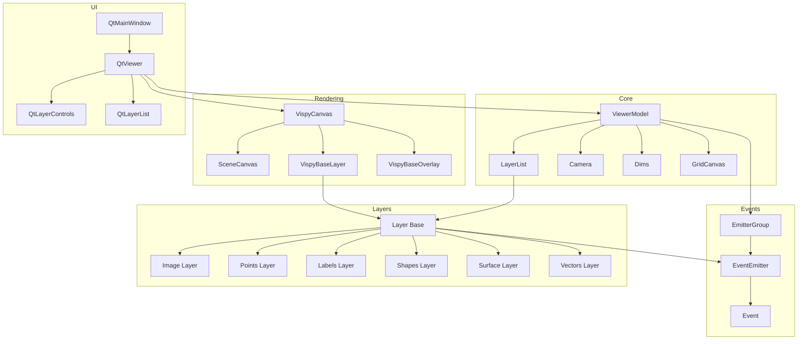

(high-level-diagram)=

# High level diagram

The diagram below shows a logical view of the napari architecture.
It should be viewed as a high-level overview of the main components and their relationships.

